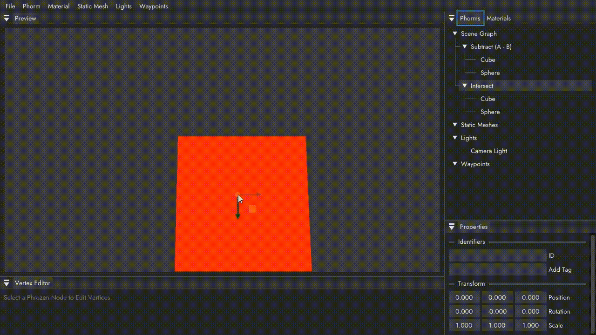
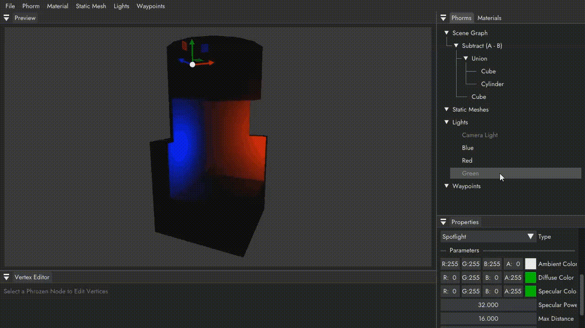
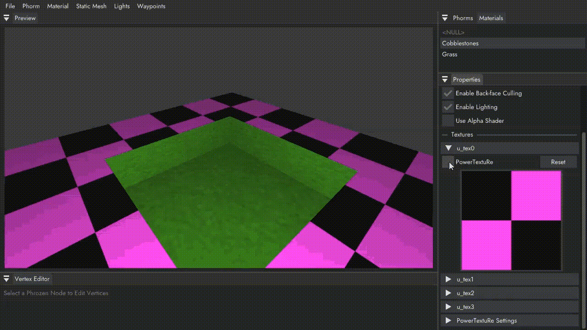
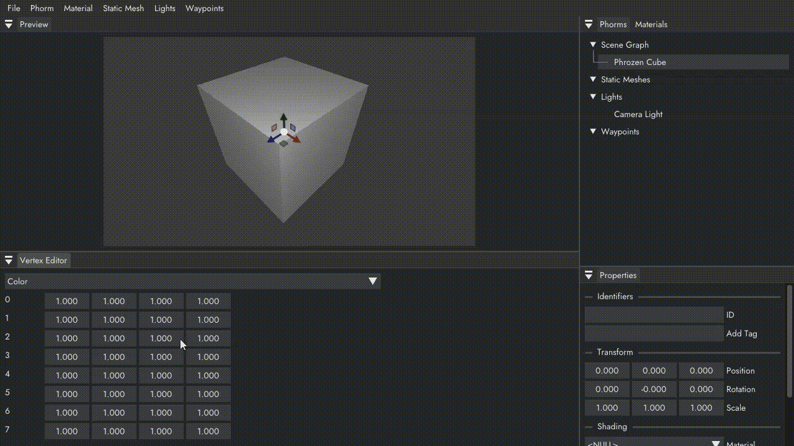

# PowerTranzphormR

A level editor for making mid-late 90's style 3D worlds using constructive solid geometry.

Get more info and a pre-built version [here](https://personal.utdallas.edu/~hsa190003/).

## **Welcome to the future of 3-dimensional modeling and design!**

**_PowerTranzphormR®_** gives developers the power to create video game worlds like those in today's next-generation games: _Super Mario 64_, _GoldenEye: 007_, _Quake_, and many others.

Pushing the boundaries of virtual reality experiences has never been so easy (and fun!)!

Learn how to em*Power* your digital content creation pipeline below.

## Cool features!

### Real-Time Constructive Solid Geometry

Create complex **Phormz®** from simple Boolean operations and geometric primitives. Are primitives a little too, err... primitive, for you? Then you'll be relieved to know that our CSG pipeline seamlessly supports manually deformed meshes, for ultimate artist control!

### State-of-the-Art Lighting Effects

Let there be **light**! Illuminate your scenes with Area, Point, Spot, and Directional Lights. Separate controls for ambient, diffuse, and specular parameters, along with additional type-specific controls, enable artists to define a unique aesthetic for every level.

### Integrated Procedural Texture Generation

Transfer your imagination to the screen! Our **PowerTextuRe®** pipeline generates **cool** textures from simple text prompts. Disappointed by the lacklustre offerings of popular CD-ROM texture catalogs? In one click, **PowerTextuRe®** provides the perfect tiling texture automatically converted to a game-ready resolution. _(Requires [AUTOMATIC1111 Stable Diffusion WebUI](https://github.com/AUTOMATIC1111/stable-diffusion-webui))._

### Fine-Grained Geometry Manipulation

Sometimes, even CSG and advanced lighting techniques aren't enough. That's why **_PowerTranzphormR®_** provides direct vertex manipulation capabilities to satisfy even the most demanding artist. Make your designs pop with **per-vertex colors**, texture blending, and UV animation.
